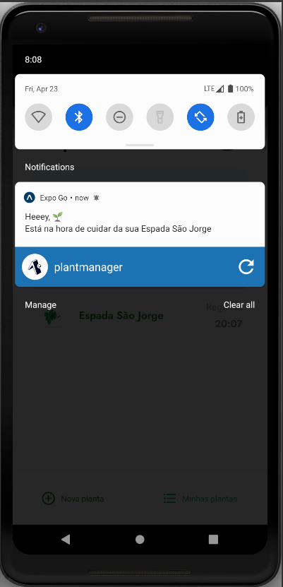

# 🌱 Plant Manager 🌱

Esta aplicação foi desenvolvida na NLW 5 da Rocketseat, na trilha de React Native.
Ela tem como objetivo alertar o horário de regar as plantas cadastradas através de uma notificação.

## Demo

### Android
#### Live demo


#### Notificação para regar uma planta


## Node
Este projeto foi criado com o Node versão 12.x.

## Expo CLI
Este projeto foi criado com o [Expo CLI](https://expo.io/). É necessário tê-lo instalado em seu computador.

## JSON-SERVER
Necessário instalar de forma global para rodar uma API fictícia.
Instale com o comando
```
npm install -g json-server
```

## Como rodar o projeto

Para simular dados vindos de uma API e com um *delay*, foi utilizado a lib [json-server](https://github.com/typicode/json-server).
Por isso, antes de rodar o projeto, suba o servidor com o comando abaixo.
Lembre-se de alterar para o IP do seu computador.
```
json-server ./src/services/server.json --host 192.168.0.11 --port 3333 --delay 700
```

No arquivo `src/services/api.ts` altere o `baseURL` para o IP do seu computador.

Após isso, basta rodar o projeto com o comando
```
yarn start
```

## Third-part libraries

### [axios](https://github.com/axios/axios)
Utilizada para requisições à API

### [date-fns](https://date-fns.org/)
Utilizada para conversões de datas e tempos.


